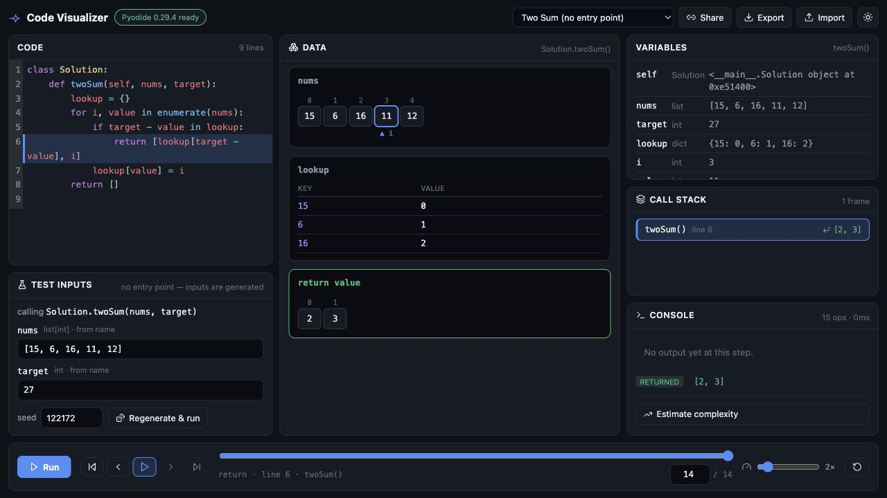
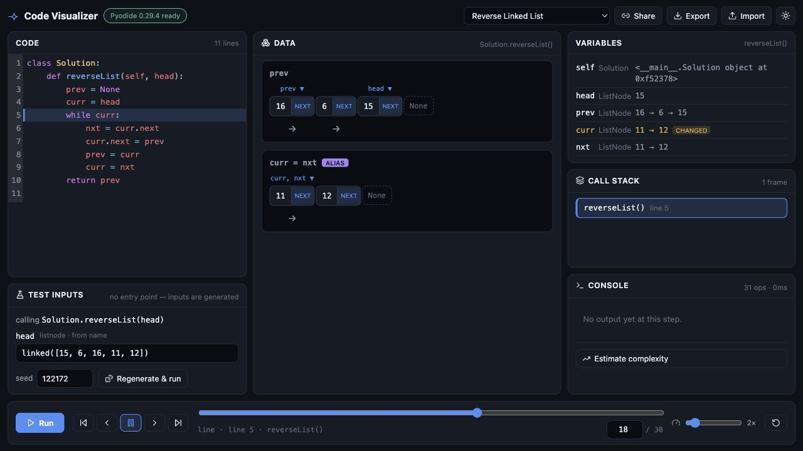

<p align="center">
  
</p>

# Code Visualizer

**See your code run, line by line.**

Code Visualizer turns short programs into replayable execution traces. Paste an
algorithm, press run, and watch variables, pointers, calls, objects, stdout,
return values, and exceptions move together through a timeline.

It is built for the moments when code is technically correct but still hard to
see: learning recursion, tracing interview problems, teaching data structures,
or understanding how state mutates one line at a time.

## Preview





## Highlights

- Trace Python, JavaScript, and TypeScript snippets in the browser.
- Step forward and backward through a recorded execution timeline.
- See active lines, changed variables, call stack frames, stdout, return values,
  and runtime errors in sync.
- Visualize arrays, strings, dictionaries, binary trees, linked lists, object
  references, aliases, and heap state.
- Generate editable Python function inputs for LeetCode-style snippets.
- Save compact practice cases, add generated edge cases, run all cases, rerun
  only failed cases, and promote trusted actual output into expected output.
- Keep a local practice notebook with pattern tags, review status, and notes for
  each code/function pair.
- Track pointer variables such as `i`, `left`, `right`, `lo`, `hi`, `prev`,
  `curr`, and `nxt`.
- Inspect recursive execution with a persistent call tree.
- Ask the hosted AI explainer to translate the current trace step into plain
  language.
- Save signed-in history, share runnable links, import/export trace sessions,
  and copy iframe embeds.
- Export animated SVG replays for notes, lessons, and writeups.
- Switch between polished light and dark themes.

## How It Feels

Code Visualizer is not a print-debugging replacement. It is a visual surface for
state.

The dashboard keeps the editor, trace controls, current data structure, locals,
call stack, console, and explainer close together so you can compare what the
code says with what the program actually did. The landing page includes a live
demo, preset algorithms, and structure previews for variables, arrays, linked
lists, trees, heap references, call stack frames, console output, and complexity
hints. For interview practice, the test inputs panel also keeps saved cases,
edge-case generation, failure reruns, and a local notebook close to the trace
without opening a separate workspace.

## Languages

| Language   | Support                                                                                                        |
| ---------- | -------------------------------------------------------------------------------------------------------------- |
| Python     | Richest mode: generated inputs, specialized structures, recursion, complexity sampling, and deep trace panels. |
| JavaScript | Browser-worker script tracing with line steps, locals, arrays, stdout, and runtime errors.                     |
| TypeScript | Basic annotation stripping before the JavaScript tracing path.                                                 |

Python tracing runs through Pyodide and WebAssembly inside a Web Worker.
JavaScript and TypeScript run in a separate browser worker.

## Privacy Model

- User code execution and trace generation happen in the browser.
- Practice cases and notebook notes are stored locally in your browser.
- AI explanations use only the selected trace step and surrounding code context.
- Signed-in history is stored for your account so traces can be reopened later.

## Quick Start

```bash
npm install
npm run dev
```

Open the printed local URL, choose an example, or paste your own snippet.

For Python function-only snippets, Code Visualizer fills the test inputs panel
with generated literals. You can edit those inputs, change the seed, regenerate,
and run again. The folded Cases section can save inputs, generate edge cases,
compare optional expected output, rerun failures, and load any case back into
the trace. The folded Notebook section stores pattern tags, review status, and
notes locally for that exact snippet.

## Examples To Try

| Example                       | What to watch                                                                |
| ----------------------------- | ---------------------------------------------------------------------------- |
| Two Sum                       | Dictionary updates, generated `nums` and `target`, saved cases, and edge cases. |
| Reverse Linked List           | `prev`, `curr`, and `nxt` aliases as each `next` link flips.                 |
| Binary Tree Inorder Traversal | Recursive frames opening and closing around a rendered tree.                 |
| Binary Search                 | `lo`, `mid`, and `hi` converging on the answer.                              |
| Loop accumulator              | Plain script execution with stdout and variable changes.                     |

## Development

```bash
npm run test
npm run build
npm run ci
```

Full deployment and operations notes live in [docs/deployment.md](docs/deployment.md).

## Ownership, Use, and Attribution

Code Visualizer was created, designed, and developed by **Harsit Upadhya**.

Copyright 2026 Harsit Upadhya.

The software in this repository is available under the
[PolyForm Noncommercial License 1.0.0](LICENSE). You may use, study, modify, and
share it for permitted noncommercial purposes. Commercial or revenue-generating
use—including resale, paid access, advertising-supported hosting, incorporation
into a paid product or service, or use intended for commercial advantage—is not
licensed without prior written permission from Harsit Upadhya.

If you distribute the software or a modified version, you must include the
license and preserve the required creator and copyright notice in [NOTICE](NOTICE):

> **Code Visualizer — created by Harsit Upadhya**
>
> <https://github.com/harsit14/code_visualizer>

Original documentation, screenshots, the logo, and other visual assets are
available for noncommercial sharing and adaptation under
[CC BY-NC 4.0](CONTENT-LICENSE.md), with attribution. Third-party dependencies
and materials remain subject to their own licenses.

Because commercial use is restricted, this project is **source-available**, not
open source as defined by the Open Source Initiative. The licenses do not grant
permission to imply endorsement or ownership by anyone else.

## Project Notes

- Custom Python class instances render as attribute tables unless they match
  recognized `TreeNode` or `ListNode` shapes.
- JavaScript and TypeScript tracing is intentionally lighter than Python mode.
