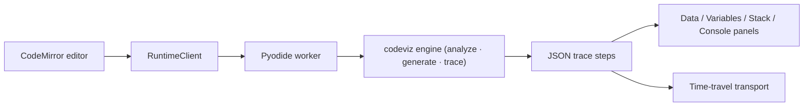

# Code Visualizer

Paste **any** Python code — a script, or a bare LeetCode-style function with no
entry point and no inputs — and watch it execute step by step: variables,
call stack, arrays with pointer markers, dicts, binary trees, linked lists,
stdout, return values, and exceptions, all on a scrubable timeline.

Everything runs **in your browser** (Pyodide / WebAssembly). No server, no
setup, nothing leaves your machine.

> 🖼️ _Screenshot placeholder: dashboard running `Solution.twoSum` with
> generated inputs, array pointer markers, and the dict build-up._
>
> 🎞️ _GIF placeholder: scrubbing back and forth through a linked-list
> reversal._

## Highlights

- **Universal code support.** Scripts run as-is. Code with no entry point
  (e.g. `class Solution: def twoSum(self, nums, target): ...`) is analyzed
  with `ast`: the tool finds callables, infers parameter types from type
  hints, usage patterns (`p.next`, `grid[i][j]`, `s.lower()`), and naming
  conventions (`nums`, `root`, `head`, `intervals`…), then **generates
  seeded random test inputs** and calls the function for you.
- **Built-in LeetCode structures.** `TreeNode` / `ListNode` are injected when
  referenced, with `tree([3, 9, 20, None, None, 15, 7])` and
  `linked([1, 2, 3])` literals you can edit in the UI. Trees render as node
  diagrams, linked lists as chained boxes — including aliases and mid-chain
  pointers (`slow`, `fast`, `prev`) during rewiring.
- **Time-travel debugging.** The full trace is recorded; play, pause, step
  forward/back, jump to any step, or drag the scrubber. The Variables panel
  highlights exactly what changed at each step.
- **Pointer-aware arrays.** Index variables (`i`, `j`, `left`, `right`, `lo`,
  `hi`, …) are drawn as markers on the arrays and strings they index.
- **Exceptions land where they happened.** A crash highlights the failing
  line, jumps to that step, and shows the live state at failure.
- **Complexity hints.** One click runs the function at n = 4…64 and fits a
  growth label (O(n), O(n²), …) to the measured step counts.
- **Sessions.** Export a trace as JSON and re-import it later to replay
  without re-running; share code + seed via URL. Dark/light mode.
- **Safeguards.** Step cap, wall-clock cap, interrupt-based timeout, deep
  structure truncation, deep-recursion frame eliding.

## Quick start

```bash
npm install
npm run dev          # open the printed URL
```

Paste code or pick an example, hit **Run**. For function-only code, check the
**Test inputs** panel: edit the literals, change the seed, or
**Regenerate & run**.

## Architecture

Two halves, one repo:

```
engine/                  Python — the tracing/analysis engine (pure stdlib)
  codeviz/
    analyzer.py          ast: mode detection, callables, type inference
    inputgen.py          seeded input generation + literal DSL (tree/linked)
    tracer.py            sys.settrace tracer with step/time safeguards
    serialize.py         structure-aware value snapshots (stable object ids)
    structures.py        TreeNode / ListNode + builders
    runner.py            orchestration: analyze → generate → trace → report
    api.py               JSON request/response boundary for the worker
  tests/                 pytest suite incl. LeetCode fixtures

src/                     TypeScript — the dashboard
  engine/                worker (loads engine/*.py into Pyodide), client,
                         schema types, pure trace helpers (diff, pointers,
                         growth fitting)
  app/                   App shell, session state hook, share links
  components/            Editor, data panel, variables, call stack,
                         console, inputs, transport controls
```

The Python engine is plain stdlib Python: the **same files** run under
CPython for tests and are written into the Pyodide filesystem by the Web
Worker at startup. The worker speaks JSON to the main thread; the UI never
touches Python objects directly.



## Examples to try

| Snippet                                    | What you'll see                                                           |
| ------------------------------------------ | ------------------------------------------------------------------------- |
| Two Sum (`class Solution`, no entry point) | generated `nums`/`target`, dict building up, `i` marker walking the array |
| Reverse Linked List                        | chains splitting and re-pointing, `prev`/`curr`/`nxt` markers             |
| Binary Tree Inorder Traversal              | tree diagram + recursive call stack                                       |
| Binary Search                              | `lo`/`mid`/`hi` markers converging on a sorted array                      |
| Any script with `print`                    | stdout appearing at the step that printed it                              |

## Development

```bash
npm run ci             # typecheck + lint + vitest + build + smoke
npm run test           # frontend unit tests (vitest)
npm run test:engine    # Python engine tests (pytest, needs engine/.venv)
```

Engine test setup (once):

```bash
python3 -m venv engine/.venv
engine/.venv/bin/pip install pytest
```

The engine targets Python ≥ 3.11 (Pyodide currently ships 3.13) and has no
runtime dependencies.

## Deployment

Static hosting with cross-origin isolation headers (COOP/COEP) for
SharedArrayBuffer interrupts — see `public/_headers` and
[docs/deployment.md](docs/deployment.md). GitHub Pages deploys via
`.github/workflows/pages.yml`.

## The previous version

The original implementation (v1, the "runtime map" visualizer) is preserved
on the [`legacy/v1`](../../tree/legacy/v1) branch and the `v1-legacy` tag.
