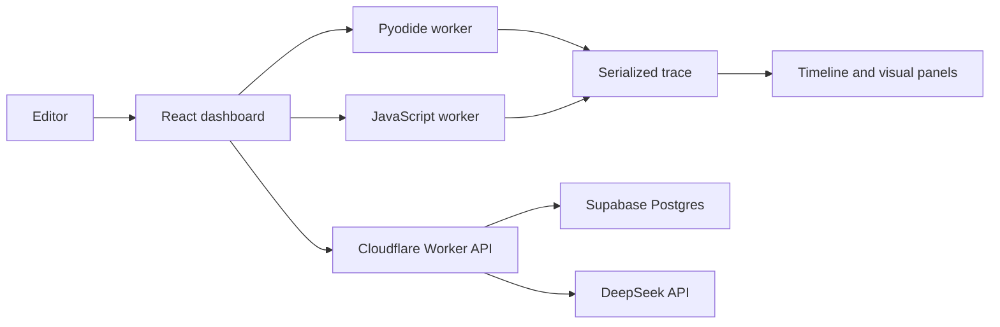

# Code Visualizer

**See your code run, line by line.**

Code Visualizer turns short programs into replayable execution traces. Paste an
algorithm, press run, and watch variables, pointers, calls, objects, stdout,
return values, and exceptions move together through a timeline.

It is built for the moments when code is technically correct but still hard to
see: learning recursion, tracing interview problems, teaching data structures,
or understanding how state mutates one line at a time.

## Preview


## Highlights

- Trace Python, JavaScript, and TypeScript snippets in the browser.
- Step forward and backward through a recorded execution timeline.
- See active lines, changed variables, call stack frames, stdout, return values,
  and runtime errors in sync.
- Visualize arrays, strings, dictionaries, binary trees, linked lists, object
  references, aliases, and heap state.
- Generate editable Python function inputs for LeetCode-style snippets.
- Track pointer variables such as `i`, `left`, `right`, `lo`, `hi`, `prev`,
  `curr`, and `nxt`.
- Inspect recursive execution with a persistent call tree.
- Ask the hosted AI explainer to translate the current trace step into plain
  language.
- Save signed-in history, share runnable links, import/export trace sessions,
  and copy iframe embeds.
- Export animated SVG replays for notes, lessons, and writeups.
- Switch between polished light and dark themes.

## How It Feels

Code Visualizer is not a print-debugging replacement. It is a visual surface for
state.

The dashboard keeps the editor, trace controls, current data structure, locals,
call stack, console, and explainer close together so you can compare what the
code says with what the program actually did. The landing page includes a live
demo, preset algorithms, and structure previews for variables, arrays, linked
lists, trees, heap references, call stack frames, console output, and complexity
hints.

## Languages

| Language   | Support                                                                                                        |
| ---------- | -------------------------------------------------------------------------------------------------------------- |
| Python     | Richest mode: generated inputs, specialized structures, recursion, complexity sampling, and deep trace panels. |
| JavaScript | Browser-worker script tracing with line steps, locals, arrays, stdout, and runtime errors.                     |
| TypeScript | Basic annotation stripping before the JavaScript tracing path.                                                 |

Python tracing runs through Pyodide and WebAssembly inside a Web Worker.
JavaScript and TypeScript run in a separate browser worker.

## Architecture

Most tracing work happens client-side. The hosted backend is only used for
accounts, saved history, daily AI quotas, and the server-side AI explainer
proxy.



### Privacy Model

- User code execution and trace generation happen in the browser.
- The browser never receives the DeepSeek API key.
- AI explanations send only the selected trace context to the Worker route
  `/api/explain-step`.
- Account, session, usage, and history data live in Supabase behind the
  Cloudflare Worker.

## Tech Stack

- React 19 and Vite
- CodeMirror editor
- Pyodide for Python execution
- Browser Web Workers for runtime isolation
- Cloudflare Workers with Static Assets
- Supabase Postgres for accounts, sessions, usage counters, and saved history
- DeepSeek for hosted step explanations
- Vitest, ESLint, TypeScript, and Python engine tests

## Quick Start

```bash
npm install
npm run dev
```

Open the printed local URL, choose an example, or paste your own snippet.

For Python function-only snippets, Code Visualizer fills the test inputs panel
with generated literals. You can edit those inputs, change the seed, regenerate,
and run again.

## Examples To Try

| Example                       | What to watch                                                                |
| ----------------------------- | ---------------------------------------------------------------------------- |
| Two Sum                       | Dictionary updates, generated `nums` and `target`, and moving array markers. |
| Reverse Linked List           | `prev`, `curr`, and `nxt` aliases as each `next` link flips.                 |
| Binary Tree Inorder Traversal | Recursive frames opening and closing around a rendered tree.                 |
| Binary Search                 | `lo`, `mid`, and `hi` converging on the answer.                              |
| Loop accumulator              | Plain script execution with stdout and variable changes.                     |

## Hosted Deployment

The production shape is Cloudflare Workers with Static Assets plus Supabase.

```bash
npm run build
npx wrangler deploy
```

Required Worker runtime variables and secrets:

| Name                        | Type     | Purpose                                           |
| --------------------------- | -------- | ------------------------------------------------- |
| `SUPABASE_URL`              | Variable | Supabase project URL.                             |
| `SUPABASE_SERVICE_ROLE_KEY` | Secret   | Server-side Supabase service role key.            |
| `PASSWORD_PEPPER`           | Secret   | Signs account password hashes.                    |
| `ANON_USAGE_SALT`           | Secret   | Hashes anonymous usage subjects for daily limits. |
| `DEEPSEEK_API_KEY`          | Secret   | Enables hosted AI explanations.                   |
| `ADMIN_EMAILS`              | Variable | Optional comma/space-separated admin allowlist.   |

Run the Supabase schema from:

```text
supabase/migrations/0001_app_schema.sql
```

Full deployment notes live in [docs/deployment.md](docs/deployment.md).

## Development Commands

```bash
npm run typecheck      # TypeScript project checks
npm run lint           # ESLint
npm run test           # Vitest suite
npm run build          # Production build
npm run smoke          # Production smoke check
npm run ci             # Typecheck, lint, tests, build, smoke
```

Python engine tests:

```bash
python3 -m venv engine/.venv
engine/.venv/bin/pip install pytest
npm run test:engine
```

The Python engine targets Python 3.11+ and uses the standard library at
runtime.

## Project Notes

- Custom Python class instances render as attribute tables unless they match
  recognized `TreeNode` or `ListNode` shapes.
- JavaScript and TypeScript tracing is intentionally lighter than Python mode.
- Stripe billing helpers are present but parked until pricing is ready to ship.
- Static-only hosts can run the visualizer, but accounts, saved history, and
  AI explanations require the Cloudflare Worker API.
