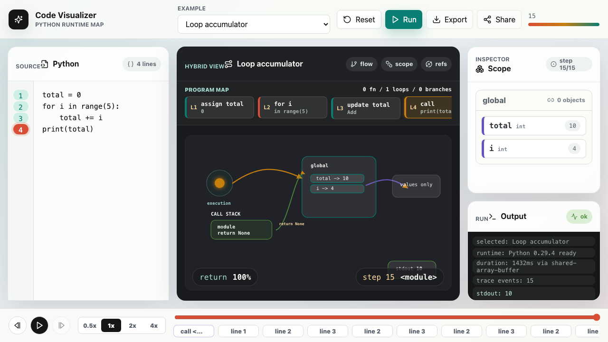
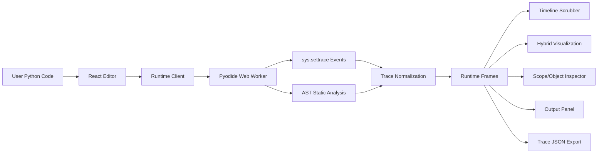

# Code Visualizer

Code Visualizer is a Python-first runtime visualization app for learning how code actually executes. Paste Python, run it in the browser, and scrub through a visual trace of lines, variables, scopes, references, loops, functions, objects, mutations, stdout, and errors.



## What It Does

- Runs Python entirely in the browser with Pyodide and a Web Worker.
- Records line-by-line execution using `sys.settrace`.
- Shows variables as live scope entries and object references as arrows.
- Preserves Python object identity so aliases and mutations are shown truthfully.
- Visualizes loop progress, function calls, recursion, return values, and runtime errors.
- Lets users play, pause, step, scrub, change speed, inspect objects, share code links, and export trace JSON.

## Why This Exists

Most beginner debugging tools show text tables, raw stack traces, or isolated line highlights. This project tries to make execution feel spatial: scopes become containers, values become objects, references become arrows, and the timeline becomes a replayable story.

The goal is not to replace a debugger. It is to make Python execution easier to explain, teach, and reason about.

## Architecture



## Runtime Model

The app uses a snapshot-first tracing model:

1. User code is compiled as `<user_code>`.
2. `sys.settrace` records call, line, return, exception, and trace-limit events.
3. Each step snapshots locals, scopes, stdout/stderr prefix lengths, object ids, object previews, and shallow collection entries.
4. Snapshots are diffed to infer variable creation, value updates, reference changes, and in-place object mutations.
5. Static AST analysis maps runtime line events back to assignments, calls, loops, branches, functions, and returns.
6. The React UI renders the normalized trace as a scrubable runtime map.

This keeps the system faithful to Python semantics without relying on brittle AST instrumentation for basic behavior.

## Current Capabilities

- Python examples for variables, loops, list aliasing, recursion, and dictionary mutation.
- Line highlighting and line-to-step jumping.
- Timeline playback with `0.5x`, `1x`, `2x`, and `4x` speed controls.
- Compact timeline rendering for large traces.
- Hybrid visual map with scope boxes, reference arrows, loop lanes, function frames, and output nodes.
- Scope inspector with variable status markers and object detail tables.
- Shallow structured object serialization for lists, tuples, dictionaries, sets, and simple custom objects.
- Timeout handling with `SharedArrayBuffer` interrupt support when available and worker restart fallback.
- Shareable `#cv=` code links.
- JSON trace export.

## Tech Stack

- React
- TypeScript
- Vite
- Pyodide
- Web Workers
- SVG
- Vitest
- ESLint
- Prettier

## Getting Started

```bash
npm install
npm run dev
```

Then open the local URL printed by Vite.

## Scripts

```bash
npm run dev         # start local dev server
npm run build       # typecheck and build production assets
npm run preview     # preview the production build
npm run typecheck   # TypeScript project check
npm run lint        # ESLint
npm run test        # Vitest
npm run smoke       # production asset/header smoke checks
npm run ci          # full verification pipeline
npm run format      # check formatting
```

## Project Structure

```text
src/
  app/                  App shell and share-link helpers
  components/           Editor, toolbar, timeline, inspector, visualization
  examples/             Built-in Python examples
  languages/python/     Pyodide worker, runtime client, trace types
  styles/               Theme tokens and app CSS
  tests/                App-level tests
  visualization/        Visualization model types
scripts/
  smoke-check.mjs       Production build smoke check
docs/
  assets/               README screenshots and media
```

## Verification

The current verification target is:

```bash
npm run ci
npm run format
```

The test suite includes runtime client helpers, built-in example checks, and share-link encoding/decoding.

## Roadmap

- Expand nested object inspection.
- Improve `while`, `break`, `continue`, and deeply nested loop visuals.
- Add richer recursion compression and exception unwinding views.
- Export the visualization as SVG/PNG.
- Add JavaScript and TypeScript adapters.
- Add guided explanations for each step.
