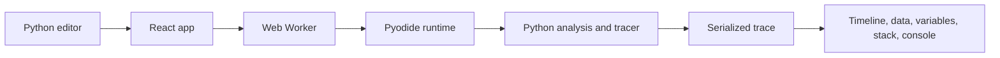

# Code Visualizer

Code Visualizer is an in-browser Python debugger for learning algorithms,
understanding data structures, and replaying code execution step by step.

Paste a Python script or a LeetCode-style function, run it, and scrub through
the trace to see variables, call stack frames, arrays, dictionaries, strings,
trees, linked lists, stdout, return values, and exceptions as they change.

Everything runs locally in the browser through Pyodide and WebAssembly. No
backend server is required for tracing user code.

## Screenshots


## Features

- Run regular Python scripts or function-only snippets.
- Automatically detect callable functions and generate editable test inputs.
- Infer common parameter types from type hints, usage, and naming conventions.
- Visualize arrays, strings, dictionaries, binary trees, and linked lists.
- Show pointer markers for indexes such as `i`, `left`, `right`, `lo`, and `hi`.
- Step forward and backward through a recorded execution trace.
- Highlight changed variables at each step.
- Show stdout, return values, exceptions, and the active call stack.
- Estimate growth behavior from repeated runs at increasing input sizes.
- Export and import trace sessions, or share code and inputs through a URL.
- Switch between light and dark themes.

## Quick Start

```bash
npm install
npm run dev
```

Open the printed local URL, choose an example or paste your own Python, then
click **Run**.

For function-only snippets, Code Visualizer fills the **Test inputs** panel
with generated literals. You can edit those inputs, change the seed, or
regenerate and run again.

## Examples To Try

| Example                       | What to look for                                                               |
| ----------------------------- | ------------------------------------------------------------------------------ |
| Two Sum                       | Generated `nums` and `target`, dictionary updates, and an array pointer marker |
| Reverse Linked List           | List nodes rewiring, aliases, and moving `prev`/`curr`/`nxt` labels            |
| Binary Tree Inorder Traversal | Recursive stack frames and a rendered tree                                     |
| Binary Search                 | `lo`, `mid`, and `hi` markers converging on the answer                         |
| Loop accumulator              | Plain script execution and stdout timing                                       |

## How It Works

Code Visualizer has a React frontend and a Python tracing engine. The frontend
loads the Python engine into a Web Worker running Pyodide. The engine analyzes
the submitted code, prepares inputs when needed, executes the program under a
trace hook, serializes each step to JSON, and sends the trace back to the UI.



## Development

```bash
npm run ci             # typecheck, lint, tests, build, and smoke check
npm run test           # frontend tests
npm run test:engine    # Python engine tests
```

Engine test setup:

```bash
python3 -m venv engine/.venv
engine/.venv/bin/pip install pytest
```

The Python engine targets Python 3.11+ and uses the standard library at
runtime.
