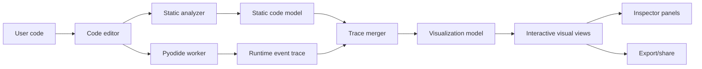

# Code Visualizer Plan

## 1. Product Vision

Build a full-fledged, deployable code visualization web app that helps people understand how Python code works while it runs. The app should accept Python code, analyze it, execute it safely in the browser, and generate an interactive visual explanation of:

- Control flow: line order, branches, loops, function calls, returns, exceptions.
- Data flow: variables created, updated, referenced, mutated, and scoped.
- Loop behavior: iteration count, changing variables per iteration, break/continue paths.
- Function behavior: call stack, arguments, local variables, return values.
- Object behavior: lists, dictionaries, sets, tuples, classes, object references, mutations.
- Execution story: a step-by-step timeline users can scrub, play, pause, inspect, and share.

The visual style should feel creative and memorable, but still precise. Think of the output as a "runtime map" of the code: boxes for scopes and objects, arrows for references and transitions, tracks for timeline events, markers for reads/writes, and loop-specific visual motifs that show repeated motion clearly.

The first target language is Python. The system should be designed so JavaScript, TypeScript, Java, C, or other languages can be added later through language adapters.

## 2. Deployment Goal

The project should be deployable from a GitHub repository to a personal Cloudflare Pages URL.

Primary deployment target:

- GitHub repo connected to Cloudflare Pages.
- Static frontend deployed by Cloudflare Pages.
- Python execution runs client-side inside a browser worker using Pyodide.
- No arbitrary user code execution on our server.

Optional future backend:

- Cloudflare Worker for share links, saved examples, usage metrics, auth, or AI-assisted explanations.
- Cloudflare D1 or KV for persisted snippets and generated visualization metadata.
- R2 for larger saved artifacts if needed.

The MVP should not require a paid backend service.

## 3. Core User Experience

### First Screen

The first screen should be the actual tool, not a marketing page.

Layout:

- Left: code editor.
- Center/right: visualization canvas.
- Bottom: execution timeline and step controls.
- Side panel: variable/scope inspector.
- Top toolbar: run, reset, examples, visualization mode, export/share.

Expected actions:

- Paste or type Python code.
- Click Run.
- Watch the visualization animate.
- Scrub through execution step by step.
- Click variables, arrows, scopes, loops, and timeline events for details.
- Switch between visualization views.

### Visualization Modes

1. Flow Map
   - Shows source lines as nodes.
   - Arrows show execution jumps.
   - Branches split into labeled true/false paths.
   - Loops form cyclic paths with iteration badges.

2. Variable Universe
   - Scopes are containers.
   - Variables are labeled handles.
   - Values are object boxes.
   - References are arrows from names to objects.
   - Mutations pulse on the object box instead of pretending a new object was created.

3. Loop Observatory
   - Each loop becomes a ring or track.
   - Each iteration becomes a bead/marker around the loop.
   - Variables that change per iteration are shown as small trails or sparkline strips.
   - Break and continue events get distinct exit markers.

4. Function Theater
   - Call stack appears as layered frames.
   - Arguments flow into a function frame.
   - Locals appear inside the frame.
   - Return values travel back to the caller.

5. Timeline Story
   - A chronological event rail.
   - Each event has an icon/type: read, write, call, return, branch, loop, exception, print.
   - Clicking an event highlights the relevant source line and visual objects.

6. Hybrid View
   - Combines source line execution, current scopes, and important arrows.
   - This can become the default view once the primitives are stable.

## 4. Design Principles

- Clear before clever: visual creativity must reveal code behavior, not decorate it.
- Every marker means something: colors, arrows, pulses, and shapes need a consistent legend.
- Step-by-step and big-picture: users should understand one event and the whole program.
- Truthful object model: references and mutations should match Python semantics.
- Safe execution: user code should be isolated, time-limited, and unable to access the host page.
- Explainable internals: event data should be inspectable and exportable as JSON.
- Progressive depth: beginners see friendly visuals; advanced users can open raw traces.

## 5. Technical Stack

### Frontend

- React with TypeScript.
- Vite for local development and production build.
- Monaco Editor or CodeMirror 6 for Python editing.
- Zustand or Redux Toolkit for app state.
- React Flow, D3, or custom SVG/canvas layers for visualizations.
- Framer Motion or CSS/Web Animations for transitions.
- Web Workers for Pyodide execution and trace generation.
- Vitest for unit tests.
- Playwright for browser and visual regression tests.

Recommended initial choice:

- React + TypeScript + Vite.
- CodeMirror 6 for editor, because it is lighter and easier to style.
- SVG plus D3 utilities for first visualizations.
- Canvas only when traces become large enough to need it.

### Python Runtime

- Pyodide loaded in a Web Worker.
- Runtime tracing starts with `sys.settrace` plus scope/object snapshots.
- AST instrumentation is a post-MVP enhancement, not a dependency for the first working product.
- Hard execution timeout enforced from the worker host.
- Preferred interruption path: Pyodide `setInterruptBuffer` with `SharedArrayBuffer`.
- Fallback interruption path: terminate and recreate the worker when cooperative interruption is unavailable.
- Stdout/stderr captured and returned as trace events.
- Basic package imports limited at first.

### Cloudflare

- Cloudflare Pages for static app hosting.
- Build command: `npm run build`.
- Output directory: `dist`.
- `public/_headers` configured for cross-origin isolation if `SharedArrayBuffer` interrupts are enabled.
- Optional future Cloudflare Worker API for share links.

## 6. High-Level Architecture



The app should separate three concerns:

- Analysis: understand code structure before running.
- Tracing: observe what happens while code executes.
- Visualization: turn analysis and trace data into visual objects.

## 7. Language Adapter Architecture

Create a language adapter boundary from the beginning.

```ts
interface LanguageAdapter {
  id: string;
  label: string;
  fileExtensions: string[];
  analyze(source: string): Promise<StaticCodeModel>;
  execute(source: string, options: ExecutionOptions): Promise<RuntimeTrace>;
  buildVisualization(input: VisualizationInput): Promise<VisualizationModel>;
}
```

For the first version:

- `pythonAdapter` implements all methods.
- Later languages can implement the same adapter shape.

## 8. Python Static Analysis

The static analyzer should parse Python and create a structural model.

Initial capabilities:

- Functions and classes.
- Imports.
- Assignments.
- Variable reads and writes.
- Branches.
- Loops.
- Function calls.
- Returns.
- Break/continue.
- Try/except/finally.
- Comprehensions, at least enough to display them as compact loop-like nodes.

Implementation options:

1. Use Python `ast` inside Pyodide.
   - Accurate Python parsing.
   - Easy to enrich with line/column metadata.
   - Runs in the same worker as execution.

2. Use tree-sitter-python in TypeScript.
   - Useful for fast editor-linked parsing.
   - Better for incremental syntax work.
   - More setup cost.

Recommended path:

- Start with Python `ast` in Pyodide for correctness.
- Add tree-sitter later only if editor-level interactivity needs it.
- Treat AST parsing and AST instrumentation as separate projects. Parsing is MVP; behavior-changing source rewriting is not.

Static model should include:

```ts
type StaticCodeModel = {
  language: 'python';
  sourceHash: string;
  lines: SourceLine[];
  symbols: SymbolRecord[];
  scopes: StaticScope[];
  controlNodes: ControlNode[];
  references: StaticReference[];
  diagnostics: Diagnostic[];
};
```

### MVP Language Scope

The first working version should support common beginner and intermediate Python:

- Assignments and reassignment.
- Arithmetic and boolean expressions.
- `if`/`elif`/`else`.
- `for` and `while` loops.
- `break` and `continue` when observable from line flow.
- Functions, arguments, returns, and recursion within limits.
- Lists, dictionaries, sets, tuples, and simple custom objects.
- Exceptions at a basic trace/reporting level.

Explicitly out of scope for MVP:

- `async`/`await`.
- Threads and multiprocessing.
- Generators and advanced coroutine behavior.
- Deep import tracing.
- Full expression-level read/write capture.
- Perfect comprehension visualization.

Unsupported constructs should produce a friendly diagnostic when possible, not a broken visualization.

## 9. Python Runtime Tracing

Runtime tracing should emit an event stream.

Event examples:

- `execution_started`
- `line_entered`
- `scope_entered`
- `scope_exited`
- `variable_created`
- `variable_read`
- `variable_updated`
- `object_created`
- `object_mutated`
- `reference_changed`
- `branch_evaluated`
- `loop_entered`
- `loop_iteration_started`
- `loop_iteration_ended`
- `loop_exited`
- `function_called`
- `function_returned`
- `exception_raised`
- `stdout_written`
- `execution_finished`
- `execution_timeout`

Trace shape:

```ts
type RuntimeTrace = {
  runId: string;
  sourceHash: string;
  startedAt: number;
  endedAt?: number;
  status: 'ok' | 'error' | 'timeout';
  events: TraceEvent[];
  stdout: string;
  stderr: string;
  diagnostics: Diagnostic[];
};
```

Trace event shape:

```ts
type TraceEvent = {
  id: string;
  type: string;
  step: number;
  line?: number;
  column?: number;
  scopeId?: string;
  objectId?: string;
  symbolId?: string;
  valuePreview?: string;
  payload?: Record<string, unknown>;
};
```

### Tracing Strategy

Use a snapshot-first approach for the MVP:

- `sys.settrace` for line execution, function calls, returns, and exceptions.
- Scope snapshots at each user-code step.
- Object identity tracking with Python `id()`.
- Snapshot diffs to infer variable creation, reassignment, reference changes, and object mutation.
- Static `ast` analysis to provide structure for branches, loops, functions, and source mapping.

Why snapshot-first:

- It avoids changing Python semantics.
- It handles many C-level in-place mutations, such as `list.append`, by observing state changes after each step.
- It is close to the proven model used by educational Python visualizers.
- It gives enough information for the first public product: line flow, scopes, object identity, aliasing, and mutation.

AST instrumentation remains a later enhancement:

- Use it only after the snapshot tracer is stable.
- Add it selectively for expression-value capture, branch-condition values, and richer read/write events.
- Keep a fallback path where the visualizer still works without instrumentation.
- Treat tricky semantics as blockers for instrumentation: short-circuiting, comprehension scope, walrus expressions, augmented assignment, generator laziness, and exact evaluation order.

### User-Code Filtering

Only trace user code.

Implementation:

- Compile user source with a known filename, such as `<user_code>`.
- Emit trace events only for frames whose `co_filename` matches that filename.
- Exclude Pyodide internals, imported packages, tracer helpers, serializers, and visualization support code.
- Keep import execution collapsed unless a future feature explicitly visualizes imported modules.

Without this filter, traces will be flooded with runtime internals and the timeline step count will become meaningless.

### Snapshot and Serialization Rules

The tracer should serialize semantic snapshots, not raw Python objects.

Each snapshot should include:

- Active source line.
- Current call stack.
- Visible scopes.
- Variable names in each scope.
- Object IDs referenced by variables.
- Safe previews of values.
- Collection previews for lists, tuples, sets, and dictionaries.
- Object field previews for simple custom objects.

Serializer requirements:

- Track visited objects to avoid infinite recursion on cycles.
- Enforce maximum object depth.
- Enforce maximum collection preview length.
- Preserve object identity across snapshots with stable IDs derived from `id()` for the run.
- Use `repr()` fallback for arbitrary objects.
- Catch serializer errors and replace failed previews with diagnostic placeholders.

Derived event rules:

- `variable_created`: name appears in a scope where it was absent before.
- `variable_updated`: name points to a different object ID or value preview than before.
- `reference_changed`: name points to a different object ID.
- `object_mutated`: same object ID has a changed serialized preview.
- `object_created`: object ID appears for the first time in serialized reachable state.

This means mutation and reference events are usually inferred from snapshots, not intercepted at the exact operation site.

### Semantic Frame Builder

The Python side should emit normalized semantic execution frames that are already easy to scrub:

```ts
type ExecutionFrame = {
  step: number;
  eventIds: string[];
  activeLine?: number;
  callStack: RuntimeFrame[];
  scopes: RuntimeScopeSnapshot[];
  objects: RuntimeObjectSnapshot[];
  stdout: string;
  stderr: string;
  diagnostics: Diagnostic[];
};
```

The TypeScript side should convert semantic frames into visual entities, layout, and animation state. This keeps the Python tracer responsible for Python truth, while the frontend remains responsible for visual composition and future language adapters.

### Safety

Run code in a Web Worker and enforce:

- Wall-clock timeout from the main thread.
- Preferred graceful interruption through Pyodide `setInterruptBuffer`.
- Worker termination and Pyodide reinitialization as a fallback.
- Step/event limit.
- Output size limit.
- Trace size limit.
- Disable or intercept dangerous APIs where possible.
- Clear warning that browser-side Python is sandboxed but not suitable for secrets.

Important constraint:

- Python sandboxing is hard. The app should avoid server-side execution of arbitrary code. Pyodide in a worker gives useful isolation for a personal educational tool, but we still need timeouts and limits.

## 10. Visualization Data Model

The renderer should not draw directly from raw trace events. It should build a stable visualization model from semantic execution frames.

Pipeline:

- Python tracer emits raw events and semantic execution frames.
- TypeScript normalizes those frames into visualization entities and relationships.
- Layout code places entities in the active visual mode.
- Renderers animate between frame states.

```ts
type VisualizationModel = {
  runId: string;
  frames: VisualizationFrame[];
  entities: VisualizationEntity[];
  relationships: VisualizationRelationship[];
  timeline: TimelineEvent[];
  legends: LegendItem[];
};
```

The MVP should fully materialize semantic execution frames for capped traces. That makes timeline scrubbing O(1), keeps playback simple, and gives the visual layer stable input. Later, very large traces can switch to incremental frame construction or virtualization.

Entities:

- Source line nodes.
- Scope containers.
- Variable name handles.
- Object/value boxes.
- Loop tracks.
- Function frames.
- Branch gates.
- Output console nodes.

Relationships:

- Execution transitions.
- Variable-to-object references.
- Function call edges.
- Return edges.
- Parent/child scope containment.
- Object mutation links.
- Branch true/false paths.

Frame:

```ts
type VisualizationFrame = {
  step: number;
  activeLine?: number;
  activeEntities: string[];
  highlightedRelationships: string[];
  entityStates: Record<string, EntityState>;
  annotations: Annotation[];
};
```

This frame-based model makes playback, scrubbing, export, and tests easier.

## 11. Visual Language

Use a consistent marker system:

- Blue outline: active execution location.
- Green glow: variable created.
- Amber pulse: variable updated.
- Purple connector: reference from name to object.
- Red marker: exception or failed condition.
- Split diamond: branch condition.
- Ring track: loop.
- Stacked panels: call stack.
- Dashed arrow: potential/static path.
- Solid arrow: actual runtime path.
- Small tick marks: reads.
- Larger badges: writes/mutations.

Object/value boxes:

- Immutable values: compact boxes.
- Mutable collections: expandable containers.
- Lists: indexed slots.
- Dictionaries: key/value rows.
- Sets: clustered chips.
- Tuples: locked indexed slots.
- Objects/classes: field compartments.

Loops:

- `for` loop: orbit or conveyor track.
- `while` loop: condition gate feeding back into itself.
- Nested loops: nested rings or stacked tracks.
- Break: visible exit arrow.
- Continue: visible skip arrow back to loop condition/update.

## 12. App Screens

### Main Visualizer

Primary route: `/`

Components:

- `CodeEditor`
- `RunToolbar`
- `VisualizationStage`
- `TimelineScrubber`
- `ScopeInspector`
- `OutputPanel`
- `DiagnosticPanel`
- `ExampleMenu`

### Example Gallery

Route: `/examples`

Example categories:

- Variables and assignment.
- If/else branches.
- For loops.
- While loops.
- Nested loops.
- Functions and recursion.
- Lists and dictionaries.
- Classes and objects.
- Exceptions.

Each example should include:

- Code.
- Short title.
- Expected visual highlights.
- Difficulty level.

### Shared Run View

Route: `/share/:id` in the future.

For MVP, sharing can be encoded in the URL hash or query string if small enough.

Future:

- Save source and visualization metadata through a Cloudflare Worker.
- Store short IDs in KV or D1.

## 13. Suggested Repository Structure

```text
code-visualizer/
  plan.md
  package.json
  vite.config.ts
  index.html
  src/
    app/
      App.tsx
      routes.tsx
      store.ts
    components/
      editor/
      toolbar/
      timeline/
      inspector/
      panels/
    languages/
      types.ts
      python/
        pythonAdapter.ts
        pyodideWorker.ts
        staticAnalysis.ts
        traceProtocol.ts
        instrumentation/
    visualization/
      model.ts
      layout/
      renderers/
      views/
        FlowMapView.tsx
        VariableUniverseView.tsx
        LoopObservatoryView.tsx
        FunctionTheaterView.tsx
        TimelineStoryView.tsx
    examples/
      pythonExamples.ts
    styles/
      tokens.css
      global.css
    tests/
  public/
    _headers
    pyodide/
    examples/
  worker/
    python_trace/
      tracer.py
      snapshots.py
      serializer.py
      limits.py
      instrumenter.py  # post-MVP
```

The exact structure can be adjusted once the framework is initialized.

## 14. Implementation Milestones

### Milestone 0: Project Foundation

Goal: create a deployable web app shell.

Deliverables:

- Initialize Vite + React + TypeScript.
- Add linting, formatting, and tests.
- Add Cloudflare Pages build settings.
- Add `public/_headers` for cross-origin isolation when using interrupt buffers.
- Add clean app shell with editor, visualization area, timeline, and inspector layout.
- Add example Python snippets.

Success criteria:

- `npm run dev` starts locally.
- `npm run build` creates a deployable `dist`.
- App opens to the visualizer UI.

### Milestone 1: Python Worker Runtime

Goal: execute Python code safely in-browser.

Deliverables:

- Load Pyodide in a Web Worker.
- Show a polished first-run Pyodide loading state.
- Send source code from UI to worker.
- Capture stdout/stderr.
- Return success, error, or timeout.
- Add execution limits.
- Implement preferred interrupt path with `SharedArrayBuffer` when cross-origin isolation is available.
- Implement fallback timeout path that terminates and recreates the worker.
- Display plain execution output and diagnostics.

Success criteria:

- Simple Python snippets run.
- Infinite loops time out.
- The UI explains whether the run was interrupted gracefully or the worker was restarted.
- Errors show readable messages.
- The main UI stays responsive.

### Milestone 2: Basic Execution Trace

Goal: capture line-by-line execution.

Deliverables:

- Implement Python trace collector using `sys.settrace`.
- Compile user code as `<user_code>` and filter trace events to that filename.
- Emit line, call, return, exception, and finish events.
- Add trace event viewer for debugging.
- Highlight active source line during playback.
- Add timeline scrubber.

Success criteria:

- Users can play through a Python program line by line.
- Function calls and returns appear in the timeline.
- Exceptions stop execution with visible trace context.

### Milestone 3: Variables and Scopes

Goal: show variables created, updated, and referenced.

Deliverables:

- Snapshot local/global scope changes per step.
- Assign stable IDs to scopes, symbols, and objects.
- Serialize reachable objects with cycle detection and preview limits.
- Diff snapshots to infer created variables, updated variables, reference changes, and object mutations.
- Display variable boxes inside scope containers.
- Show arrows from variable names to value/object boxes.
- Show updates as animated state changes.

Success criteria:

- Assignment, reassignment, and basic object references are visible.
- Function local variables appear in separate frames.
- Mutating a list or dictionary updates the same object box.

### Milestone 4: Static Python Analysis

Goal: understand structure before and during execution.

Deliverables:

- Parse source with Python `ast`.
- Build static model for lines, symbols, functions, branches, loops.
- Match runtime events to static nodes.
- Render control-flow skeleton before running.

Success criteria:

- The visualizer can show likely paths before playback.
- Branches and loops have meaningful visual containers.
- Source diagnostics map to exact lines.

### Milestone 5: Loop Observatory

Post-MVP milestone.

Goal: make loops genuinely understandable.

Deliverables:

- Detect loop entry, iteration start/end, continue, break, and exit.
- Render loop tracks with iteration markers.
- Show per-iteration variable changes.
- Support nested loops visually.

Success criteria:

- A beginner can see how each iteration changes variables.
- Nested loops do not become visually tangled.
- Break/continue paths are unmistakable.

### Milestone 6: Function Theater

Post-MVP milestone.

Goal: make function calls and recursion clear.

Deliverables:

- Render call stack frames.
- Animate arguments into function scope.
- Animate return values back to caller.
- Support recursive calls with stacked frames.

Success criteria:

- Function calls are visually distinct from simple line movement.
- Recursion is understandable without reading raw trace data.

### Milestone 7: Rich Object Visualization

Goal: represent Python values in a Python-faithful way.

Deliverables:

- Specialized renderers for list, dict, tuple, set, object, class.
- Reference identity tracking.
- Mutation events for list/dict/set operations.
- Expand/collapse for large objects.

Success criteria:

- Aliasing is visible.
- Mutations do not look like reassignment unless reassignment happened.
- Large structures stay readable.

### Milestone 8: Polished Interaction and Export

Goal: make the app feel production-ready.

Deliverables:

- Playback speed controls.
- Step forward/back.
- Click-to-inspect entities.
- Search timeline events.
- Export trace JSON.
- Export visualization as PNG/SVG where feasible.
- Share via compressed URL hash for small examples.

Success criteria:

- Users can explore code without getting lost.
- Visual output can be shared or reused in teaching material.

### Milestone 9: Deployment and GitHub Workflow

Goal: deploy publicly through Cloudflare Pages.

Deliverables:

- GitHub repo setup.
- Cloudflare Pages project connected.
- Build command documented.
- Preview deployments for PRs.
- Production deployment from main branch.
- README with local and deployment instructions.

Success criteria:

- Pushing to GitHub deploys the app.
- Personal webpage link is live.
- The app works well on desktop widths.

## 15. Testing Strategy

### Unit Tests

- Static analyzer tests for Python syntax patterns.
- Trace normalization tests.
- Visualization model builder tests.
- Object identity and mutation tests.
- URL share encoding tests.

### Integration Tests

- Run sample Python snippets through the worker.
- Verify trace event order.
- Verify timeout behavior.
- Verify both interrupt-buffer timeout and worker-termination fallback behavior when practical.
- Verify trace events are limited to `<user_code>`.
- Verify syntax and runtime error reporting.
- Verify cyclic structures do not break serialization.

### Browser Tests

- Load app.
- Run examples.
- Scrub timeline.
- Click variables and arrows.
- Verify no layout overlap at target desktop widths.

### Visual Regression Tests

- Snapshot key examples:
  - Basic assignment.
  - For loop.
  - While loop with break.
  - Function call.
  - Recursion.
  - List mutation.
  - Dictionary updates.

## 16. Example Snippets for Development

Start with a tight suite of examples:

```python
x = 1
y = x + 2
x = y * 3
print(x)
```

```python
total = 0
for i in range(5):
    total += i
print(total)
```

```python
items = ["a", "b", "c"]
for index, value in enumerate(items):
    print(index, value)
```

```python
nums = [1, 2, 3]
same = nums
same.append(4)
print(nums)
```

```python
def factorial(n):
    if n <= 1:
        return 1
    return n * factorial(n - 1)

print(factorial(4))
```

```python
data = {"a": 1, "b": 2}
for key in data:
    data[key] = data[key] + 10
print(data)
```

## 17. Security and Abuse Considerations

Even client-side execution needs guardrails.

Controls:

- Worker isolation.
- Graceful interrupt via `SharedArrayBuffer` when cross-origin isolation is active.
- Kill and recreate worker on timeout when interrupt buffers are unavailable or fail.
- Maximum execution time.
- Maximum event count.
- Maximum stdout/stderr length.
- Maximum source length.
- Maximum serialized object depth.
- Maximum collection preview size.
- Cycle detection during serialization.
- Clear reset between runs.

Avoid for MVP:

- Server-side arbitrary code execution.
- User accounts.
- Database persistence of arbitrary snippets.
- Third-party package installation.

## 18. Performance Strategy

Trace size can grow quickly. The app should handle this from the start.

Approach:

- Lazy-load Pyodide on first run or prewarm it after the initial UI becomes interactive.
- Show an intentional loading state for Pyodide cold start.
- Prefer self-hosting Pyodide assets for predictable Cloudflare behavior and cross-origin isolation.
- Consider CDN loading only if COOP/COEP and CORS behavior are verified.
- Stream status events from worker when possible.
- Cap events and object serialization.
- Store raw events separately from derived visualization frames.
- Fully materialize semantic execution frames for capped MVP traces so scrubbing is instant.
- Virtualize long timelines.
- Incrementally build visualization frames only when trace size exceeds MVP caps.
- Use SVG for small/medium traces.
- Move heavy layout calculation off the main thread if needed.
- Consider canvas/WebGL for large traces later.

## 19. Accessibility

The visualizer should not rely only on color or motion.

Requirements:

- Keyboard controls for run/play/pause/step.
- Text labels for markers.
- High-contrast mode.
- Reduced-motion mode.
- Inspectable event list as an alternative to visual animation.
- ARIA labels for controls.
- Timeline events readable by screen readers where practical.

## 20. Cloudflare Pages Setup

Expected settings:

- Framework preset: Vite.
- Build command: `npm run build`.
- Build output directory: `dist`.
- Root directory: project root.
- Production branch: `main`.

Required headers for the preferred Pyodide interrupt strategy:

```text
/*
  Cross-Origin-Opener-Policy: same-origin
  Cross-Origin-Embedder-Policy: require-corp
  Cross-Origin-Resource-Policy: same-origin
  X-Content-Type-Options: nosniff
```

These headers should live in `public/_headers` so Vite copies them into `dist`. They make `SharedArrayBuffer` available for Pyodide interrupts. If these headers block a future cross-origin asset, either self-host that asset or load it with explicit CORS support. Do not silently remove these headers without switching the timeout strategy to worker termination.

Recommended GitHub workflow:

- `main`: production deployments.
- feature branches: preview deployments.
- Pull request checks:
  - typecheck
  - lint
  - unit tests
  - build

Optional future Worker:

```text
api/
  worker.ts
  routes/
    share.ts
    health.ts
```

Cloudflare storage options:

- KV: short-lived or simple share records.
- D1: structured saved visualizations.
- R2: large exported assets.

## 21. Initial Execution Order

When we start building, use this order:

1. Scaffold Vite + React + TypeScript.
2. Build a polished desktop app shell with editor, visualization stage, timeline, and inspector.
3. Add CodeMirror editor and starter Python examples.
4. Add Pyodide worker execution.
5. Add stdout/stderr/error display.
6. Add interrupt-buffer timeout and worker-termination fallback.
7. Add line-level trace events filtered to `<user_code>`.
8. Add timeline playback.
9. Add variable/scope/object snapshots with safe serialization.
10. Add snapshot diffing for variable/reference/mutation events.
11. Add first visualization view: Hybrid View.
12. Polish the visual language, examples, tests, and Cloudflare deployment.
13. Add Loop Observatory after MVP.
14. Add Function Theater after MVP.

## 22. MVP Definition

The deployable MVP should include:

- Python code editor.
- Run/reset controls.
- Client-side Python execution.
- Timeout and error handling.
- Line-by-line execution timeline.
- Source line highlighting.
- Variable and scope visualization.
- Object identity and alias visualization for common values.
- Snapshot-derived mutation indicators.
- One strong default Hybrid visualization.
- Several built-in examples.
- Polished desktop layout.
- Cloudflare Pages deployment instructions.

This MVP is already useful for learners and strong enough to publish on a personal page.

## 23. Post-MVP Roadmap

Advanced visualization:

- Loop Observatory.
- Function Theater.
- Branch probability or path comparison across multiple runs.
- Side-by-side "expected vs actual" trace.
- Memory graph for object aliases.
- Recursion tree mode.
- Data structure-specific animations.

Teaching features:

- Guided explanations per step.
- Quiz mode.
- Teacher share links.
- Embed mode for blog posts.
- Export to animated GIF/video.

AI-assisted features:

- Natural language explanation of trace.
- Ask questions about current step.
- Generate simpler examples from pasted code.
- Identify confusing lines and suggest visual focus.

Language expansion:

- JavaScript adapter.
- TypeScript adapter.
- Java adapter.
- C/C++ adapter through compile-to-WASM or static-only mode.

## 24. Open Decisions

Decisions to make during implementation:

- CodeMirror vs Monaco.
- SVG-only first renderer vs React Flow.
- Whether static analysis runs entirely in Pyodide or partly in TypeScript.
- Whether `SharedArrayBuffer` interrupts are available in every target deployment environment.
- How much AST instrumentation is worth adding after snapshot-first tracing is stable.
- Whether share links use URL compression first or a Cloudflare Worker immediately.
- Whether the initial visual theme should feel more like a "debugger map", "city map", or "lab bench".

Recommended defaults:

- CodeMirror.
- SVG plus D3 utilities.
- Static analysis in Pyodide first.
- Snapshot-first runtime tracing.
- Pyodide `setInterruptBuffer` with Cloudflare `_headers`, plus worker termination fallback.
- URL-hash sharing first.
- Add Cloudflare Worker only after the static app is strong.

## 25. Definition of Done for the First Public Version

The first public version is done when:

- A user can paste beginner/intermediate Python code and run it.
- The app generates a faithful step-by-step trace.
- Variables, references, object identity, and common mutations are visually understandable.
- The default Hybrid view looks polished enough to publish.
- The UI works well on desktop widths.
- Error and timeout states are polished.
- Built-in examples demonstrate the app's strengths.
- The repository has clear setup and deployment docs.
- The app is live on a Cloudflare Pages URL.
